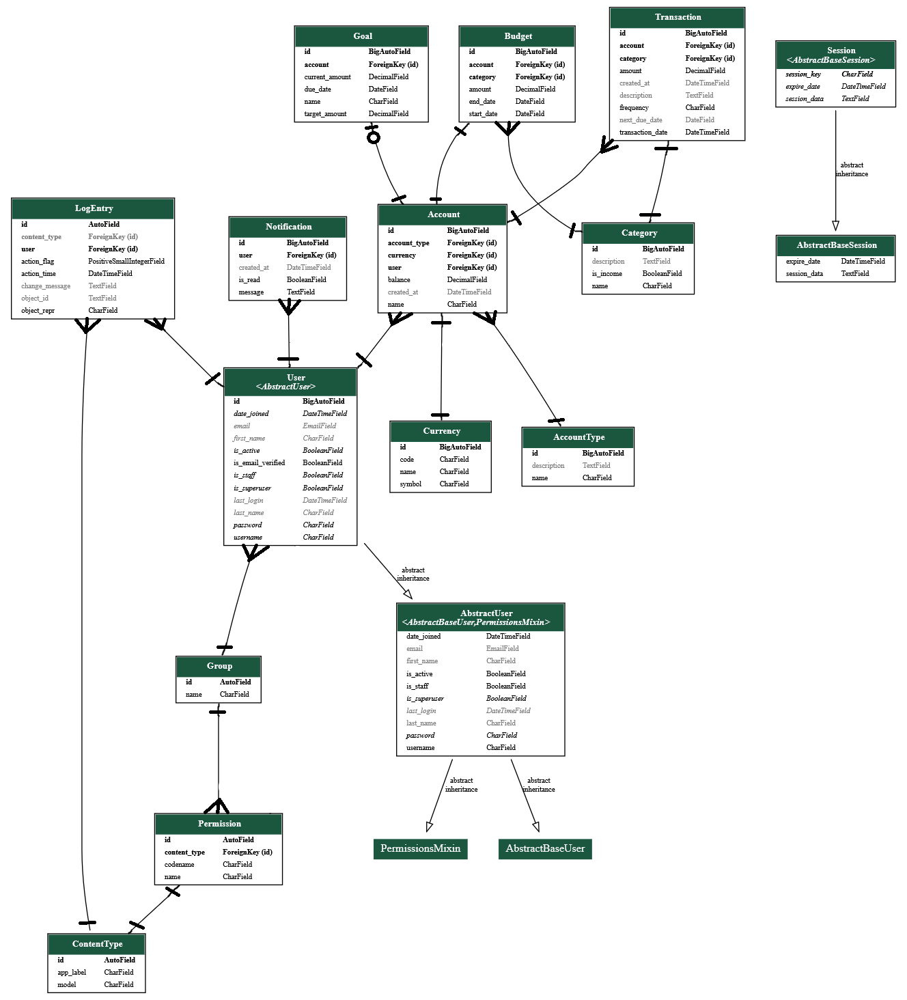

# Finance Tracker

A full-stack finance tracking web application built with **Django Rest Framework** and **React**.  
This project helps users manage their budget, track expenses, and gain insights into their spending habits.  
It also serves as a learning tool for developing full-stack applications using modern frameworks.

---

## 📄 Table of Contents
- [General Info](#📌-general-info)
- [File Structure](#📁-file-structure)
- [Technologies](#🛠️-technologies)
- [UML Diagram](#🧩-uml-diagram)
- [Setup Instructions](#🚀-setup-instructions)

---

## 📌 General Info
This project was created to:
- Track expenses and manage a personal budget
- Visualize and categorize financial data
- Practice building and deploying full-stack web applications
- Learn Django REST framework and modern React development

---

## 📁 File Structure
```
backend
├───backend
│   ├───settings.py
│   ├───test_settings.py
│   ├───urls.py
|   └───...
├───accounts
│   ├───migrations
│   ├───views.py
│   ├───serializers.py
│   ├───urls.py
|   └───...
├───budgets
│   ├───migrations
│   ├───views.py
│   ├───serializers.py
│   ├───urls.py
|   └───...
├───categories
│   ├───migrations
│   ├───views.py
│   ├───serializers.py
│   ├───urls.py
|   └───...
├───notifications
│   ├───migrations
│   ├───views.py
│   ├───serializers.py
│   ├───urls.py
|   └───...
├───reports
│   ├───migrations
│   ├───views.py
│   ├───serializers.py
│   ├───urls.py
|   └───...
├───transactions
│   ├───migrations
│   ├───views.py
│   ├───serializers.py
│   ├───urls.py
|   └───...
├───users
│   ├───migrations
│   ├───views.py
│   ├───serializers.py
│   ├───authentication.py
│   ├───urls.py
|   └───...
├─── .env
└─── manage.py

frontend
├───public
└───src
    ├───assets
    ├───components
    │   ├─── ProtectedRoute.tsx
	│   ├─── ThemeToggle.tsx
	│   ├─── TransactionForm.tsx
	|   └─── TransactionsList.tsx
    ├───contexts
	│   ├─── AuthContext.tsx
	|   └─── ThemeContext.tsx
    ├───pages
    │   ├─── AccountSelectionPage.tsx
	│   ├─── AdminPanelPage.tsx
	│   ├─── DashboardPage.tsx
	│   ├─── LandingPage.tsx
	│   ├─── LoginPage.tsx
	|   └─── RegisterPage.tsx
    ├───services
    ├───styles
    ├───theme
    └───utils
```
## 🛠️ Technologies
Project is created with:

### Backend
- **Python** 3.13.0
- **Django REST Framework** 5.1.7
		- Secure by design, with many cybersecurity options included
		- Batteries included philosophy, aimed for fast software delivery
		- Great modularity, which allows for building clean API
		- Scallable 
- **PostgreSQL** 17.1
		- Reliable and ACID-compliant
		- Advanced analysis options
		- Seamless django integration
### Frontend
- **React**
		- Designed to build dynamic interaces
		- Easy to debug with one-way data flow
		- Massive community with great amount of tutorials
- **MUI**
		- Beatiful, free to use components
		- Easy to implement
		- Light
### Dev Tools
- **Docker** (optional for deployment)

---

## 🧩 UML Diagram



---

## 🚀 Setup Instructions

### Backend Setup
```bash
$ python -m venv .venv
$ source venv/bin/activate
$ cd backend
$ pip install -r requirements.txt
$ python manage.py migrate
$ python manage.py runserver
```
### Frontend setup
```bash
$ cd frontend
$ npm i
$ npm run dev
```
### Docker setup (skip frontend setup and frontend setup)
```bash
$ docker compose up -d --build
```
